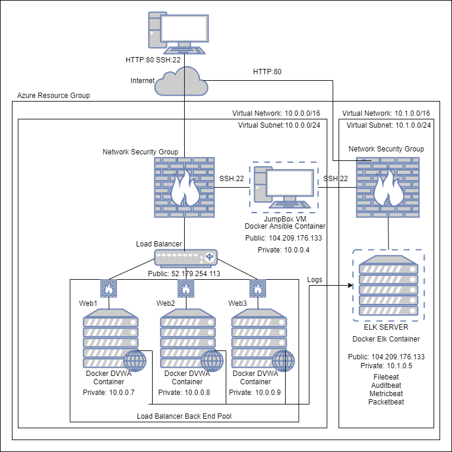
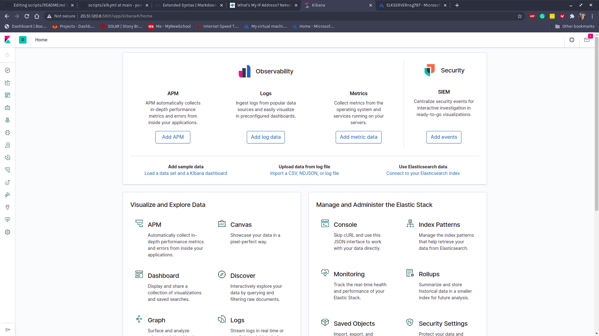

## Automated ELK Stack Deployment

The files in this repository were used to configure the network depicted below.



These files have been tested and used to generate a live ELK deployment on Azure. They can be used to either recreate the entire deployment pictured above. Alternatively, select portions of the installbeats.sh file can be used to intall portions of the ELK server such as filebeat.


This document contains the following details:
- Description of the Topologu
- Access Policies
- ELK Configuration
  - Beats in Use
  - Machines Being Monitored
- How to Use the Ansible Build


### Description of the Topology

The main purpose of this network is to expose a load-balanced and monitored instance of DVWA, the D*mn Vulnerable Web Application.

Load balancing ensures that the application will be highly available, in addition to restricting inbound to the network.  Load balancers distributes the traffic among the 3 webservers endureing that only authorized users will be able to access the virtual machines.

Integrating an ELK server allows users to easily monitor the vulnerable VMs for changes to the file system and system metrics such as CPU usage, logins, sudo escalation attempts and more.
-Filebeat watches for changes to the file systems on the VMs
-Metricbeat fsfsdfsdfsdf
-Packetbeat ddgdfgdffddfg
-auditbeat dfgdfgdfgdfgf

The configuration details of each machine may be found below.

| Name       | Function   | IP Address | Operating System |
|------------|------------|------------|------------------|
| Jump Box   | Gateway    | 10.0.0.5   | Linux            |
| Web1       | Web Server | 10.0.0.7   | Linux            |
| web2       | Web Server | 10.0.0.8   | Linux            |
| Web3       | Web Server | 10.0.0.9   | Linux            |
| Elk-Server | Elk Server | 10.1.0.5   | Linux            |
 
### ELK Server Configuration
The ELK VM exposes an Elastic Stack instance. Docker is used to download and manage an ELK container.

Rather than configure ELK manually, we opted to develop a reusable Ansible Playbook to accomplish the task. This playbook is duplicated below.

To use this playbook, one must log into the Jump Box, then issue: ansible-playbook elk.yml. This runs the elk.yml playbook on the elk host. 
```yaml
---
- name: Configure Elk VM with Docker
  hosts: elk
  remote_user: sysadmin
  become: true
  tasks:
    # Use apt module
    - name: Install docker.io
      apt:
        update_cache: yes
        force_apt_get: yes
        name: docker.io
        state: present

      # Use apt module
    - name: Install pip3
      apt:
        force_apt_get: yes
        name: python3-pip
        state: present

      # Use pip module
    - name: Install Docker python module
      pip:
        name: docker
        state: present

      # Use command module
    - name: Increase virtual memory
      command: sysctl -w vm.max_map_count=262144

      # Use sysctl module
    - name: Use more memory
      sysctl:
        name: vm.max_map_count
        value: "262144"
        state: present
        reload: yes

      # Use docker_container module
    - name: download and launch a docker elk container
      docker_container:
        name: elk
        image: sebp/elk:761
        state: started
        restart_policy: always
        published_ports:
          - 5601:5601
          - 9200:9200
          - 5044:5044

      # Enable docker service
    - name: Enable docker service
      systemd:
        name: docker
        enabled: yes
```
### Access Policies

The machines on the internal network are not exposed to the public Internet. 

Only the jump box machine can accept connections from the Internet. Access to this machine is only allowed from the following IP addresses:
- 72.229.144.217

Machines within the network can only be accessed by each other.
- Web1 Web2, and Web3 send traffic to the ELK Server

A summary of the access policies in place can be found in the table below.

| Name       | Publicly Accessible | Allowed IP Addresses |
|------------|---------------------|----------------------|
| Jump Box   | Yes                 | 72.229.144.217       |
| Web1       | No                  | 10.0.0.1-254         |
| Web2       | No                  | 10.0.0.1-254         |
| Web3       | No                  | 10.0.0.1-254         |
| Elk-Server | Yes                 | 71.229.144.217       |

### Elk Configuration

Ansible was used to automate configuration of the ELK machine. No configuration was performed manually, which is advantageous because...
- The advantage of using Ansible is that the condfiguration can be repeated automatically as new machines are added.  Also if updates need to be made the changes can take place in one file and then run to updated the individual machines.

The playbook implements the following tasks:
- Install docker
- Install python
- Install Docker python module
- Increase virtual memory
- Download and launch a docker ELK container
- Enable docker service

The following screenshot displays the result of running `docker ps` after successfully configuring the ELK instance.



### Target Machines & Beats
This ELK server is configured to monitor the following machines:
- 10.0.0.7
- 10.0.0.8
- 10.0.0.9

We have installed the following Beats on these machines:
- Filebeat - Detects changes to the filesystem.  Collects Apache logs
- Metricbeat - Detects changes in filesystem metrics such as CPU usage SSH login attempts, failed sudo escalations and CPU/RAM statistics
- Auditbeat - 
- Packetbeat - Collects packets that pass througgh the NIC, similar to Wireshark.  This traces all activity that takes place on the network.


### Using the Playbook
In order to use the playbooks, you will need to have an Ansible control node already configured. Assuming you have such a control node provisioned: 

SSH into the control node and follow the steps below:
- update hosts file within /etc/ansible and include the IPs of the Webservers
``` 
[webservers]
10.0.0.8 ansible_python_interpreter=/usr/bin/python3
10.0.0.7 ansible_python_interpreter=/usr/bin/python3
10.0.0.9 ansible_python_interpreter=/usr/bin/python3

[elk]
10.1.0.5 ansible_python_interpreter=/usr/bin/python3
```

- Copy the playbook files to the appriopriate directories in /etc/ansible (ex.: /etc/ansible/filebeat/filebeat-playbook.yml).
- Update the configuration files for each beat to include the ELK server hosts information
- Copy the configuration files to the appropriuate directory within /etc/ansible (ex: /etc/filebeat/filebeat.yml)
- Copt installbeats.sh to the /etc/ansible directory.  The file looks like this:
```
#!bin/bash

#Install and configure filebeat
ansible-playbook filebeat/filebeat-playbook.yml

#Install and configure metricbeat
ansible-playbook metricbeat/metricbeat-playbook.yml

#Install and configure auditbeat
ansible-playbook auditbeat/auditbeat-playbook.yml

#Install and configure packetbeat
ansible-playbook packetbeat/packetbeat-playbook.yml
```
This will install all 4 beats on the webservers.  If you do not want to install an specific beat just comment out the line containing it.
Ex:
```
#Install and configure packetbeat
#ansible-playbook packetbeat/packetbeat-playbook.yml
```
- Run installbeats.sh, and navigate to http://20.51.120.6:5601/app/kibana#/home


These files can be copied via git and run via the commands below:
```
$ cd /etc/ansible
# Clone Repository + IaC Files
$ git clone https://github.com/peetercee/scripts.git
# Move Playbooks and hosts file Into `/etc/ansible`
$ cp -r scripts/ansible/* .
$ sh installbeats.sh
```
